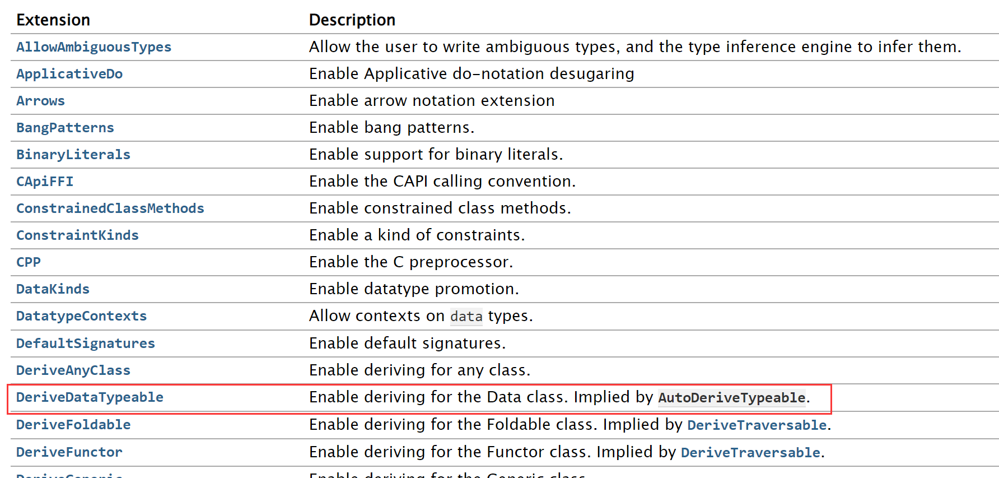

原本只是在看Parallel and Concurrent programming，结果看到一个example发现好多语法和库函数还不会，看来还是不够了解Haskell语言。

趁此机会正好踏实地一点一点看一下，看懂了还是觉得有的实现挺奇妙的，一行信息量更比六行多。

# KMeansCore

首先是KMeansCore module，代码如下：

```haskell
--
-- Adapted from the K-Means example in the remote-0.1.1 package,
--   (c) Jeff Epstein <jepst79@gmail.com>
--

{-# LANGUAGE DeriveDataTypeable #-}
module KMeansCore where

import Data.List
import Data.Typeable (Typeable)
import Data.Data (Data)
import qualified Data.ByteString.Char8 as B
import Data.Binary
import Control.DeepSeq

-- -----------------------------------------------------------------------------
-- Points

data Point = Point {-#UNPACK#-}!Double {-#UNPACK#-}!Double
    deriving (Show,Read,Eq)

-- deepseq changed in GHC 7.10 to use Generic instances, so for backwards
-- compatibility define it manually.
instance NFData Point where
  rnf (Point x y) = () -- all fields are strict

-- <<point-ops
zeroPoint :: Point
zeroPoint = Point 0 0

sqDistance :: Point -> Point -> Double
sqDistance (Point x1 y1) (Point x2 y2) = ((x1-x2)^2) + ((y1-y2)^2)
-- >>

instance Binary Point where
  put (Point a b) = do
                        put a
                        put b
  get = do 
            a <- get 
            b <- get 
            return (Point a b)

readPoints :: FilePath -> IO [Point]
readPoints f = do
                    s <- B.readFile f
                    let ls = map B.words $ B.lines s
                        points = [ Point (read (B.unpack sx)) (read (B.unpack sy))
                                | (sx:sy:_) <- ls ]
                    --
                    return points

-----------------------------------------------------------------------------
-- Clusters

data Cluster
  = Cluster { clId    :: {-# UNPACK #-} !Int
            , clCent  :: {-# UNPACK #-} !Point
            }
  deriving (Show,Read,Eq)

instance NFData Cluster where
  rnf (Cluster id cent) = () -- all fields are strict

makeCluster :: Int -> [Point] -> Cluster
makeCluster clid points =
  Cluster { clId    = clid
          , clCent  = Point (a / fromIntegral count) (b / fromIntegral count)
          }
 where
  pointsum @ (Point a b) = foldl' addPoint zeroPoint points
  count = length points

  addPoint :: Point -> Point -> Point
  addPoint (Point a b) (Point c d) = Point (a+c) (b+d)
```

1. 关于程序头部的

   ```haskell
   {-# LANGUAGE DeriveDataTypeable #-}
   ```

   实际上是Haskell的一个`pragma system`，可以起到对编译器提供额外语言信息的作用。通用语法为：

   ```haskell
   {-# <NAME> <ARGS...> #-}
   ```

   一般的pragma如果忽略是不影响程序编译运行的，但是`LANGUAGE` program稍有特殊，但它的作用仍然是声明接下来写的语言是怎样的。而在GHC的手册上可以查到不同的pragma的作用：https://downloads.haskell.org/~ghc/8.4.3/docs/html/users_guide/glasgow_exts.html

   

2. 关于类型声明中，出现了"!"感叹号。由于Haskell是lazy evaluate的，你声明一个变量p = Point (3+4) 5的时候，表达式（3+4）是不会被计算的，直至必须的时候（譬如print (show p)的时候）。这样会有一个问题就是和我们的习惯不同，如果你不断声明就会导致非常占用内存，我们有时是希望他urge evaluating的，就一开始就把表达式值算出来。

   所以使用了感叹号标记的`!Int`后，就可以满足我们的要求。

   然后会发现这里也出现了pragma：

   ```haskell
   {-# UNPACK #-}
   ```

   实际上，我查到

   ```haskell
   data Point = Point {-# UNPACK -#}!Double {-# UNPACK #-}!Double
   ```

   是一种非常严格和标准的写法。见问题：“[Why is it common to mark record fields with UNPACK and strictness?](https://stackoverflow.com/questions/50460493/why-is-it-common-to-mark-record-fields-with-unpack-and-strictness)”

   其中`UNPACK` pragma的作用可以用一个例子解释：

   

   上左图是声明

   ```haskell
   data P = P !Int !Int
   data T = T P
   ```

   的情况，右图是声明

   ```haskell
   data P = P !Int !Int
   data T = T {-# UNPACK #-} !P
   ```

   的情况，本质上还是为了不要因为type constructor嵌套太多层，导致占用大量内存。

3. 关于type class `NFData`，在Hoogle上的解释为

   > A class of types that can be fully evaluated.

   就是可以完全推算出值的一组数据类型，实际上我们常用的和能想到的都满足。它只要求一个方法：

   ```haskell
   rnf::NFData a => a -> ()
   ```

   rnf应该是“reduce to normal form”的简称，该方法实际上就是要求你给出怎么把该数据类型规约成normal form。譬如

   ```haskell
   data Pair = Pair Int Int
   
   instance NFData Pair where
     rnf (Pair a b) = (rnf a) `seq` (rnf b)
   ```

   上述代码的意思为“要规约Pair类型，即先规约Pair的第一个Int，再规约Pair的第二个Int”。同时也表达了“当Pair类型的两个Int参数都是normal form时，我们认为这个Pair类型也是normal form”。

   而在原代码中，由于使用了“！”标记，即该Double本身就已经被urge evaluate了，所以注释写了“all fields are strict”，故**声明的Point类型实例均为normal form**，用代码表示就是：

   ```haskell
   rnf _ = ()
   ```

4. 关于type class `Binary`。Hackage上查到的说明为：

   >Binary serialisation of Haskell values to and from lazy `ByteString`s. The Binary library provides methods for encoding Haskell values as streams of bytes directly in memory. The resulting `ByteString` can then be written to disk, sent over the network, or further processed (for example, compressed with gzip).
   >
   >The `binary` package is notable in that it provides both pure, and high performance serialisation.

   而需要我们实现的方法是：

   ```Haskell
   put :: t -> Put
   get :: Get t
   ```

   就是让我们实现一组编码/解码的方法。其中系统已经帮我们实现好了Int类型的编码/解码方法（具体怎么做的我也不知道，打印出来目测是大端法不知道咋编的），所以如果我们想对Point类型编码/解码，实际上就是对Point的两个Int field进行编码/解码，而Put，Get都是Monad，故有了原代码中的写法。

   实现了put和get后，就可以使用下面两个函数：

   ```haskell
   encode :: t -> ByteString
   decode :: ByteString -> t
   ```

   类型签名我写的比较随意严格来说不是这个，但不影响理解。其中`ByteString` 类型介绍如下：

   >A time- and space-efficient implementation of byte vectors using packed Word8 arrays, suitable for high performance use, both in terms of large data quantities and high speed requirements. Byte vectors are encoded as strict `Word8` arrays of bytes, held in a `ForeignPtr`, and can be passed between C and Haskell with little effort.

   实际上是通过某种编码，获得了比`String`更高性能的表现。

   **总之目前发现如果一个类型需要往文件中读写的话，实现一下instance Binary是很不错的。**

5. 关于`readFile`等一系列文件操作。

   首先有

   ```haskell
   type FilePath = String
   ```

   很好理解，就是文件目录就是个字符串，然后

   ```haskell
   readFile :: FilePath -> IO String
   ```

   很朴素的函数，从文件中读东西就返回一个字符串，然后由于可能有side effect所以套了个IO Monad。然后

   ```haskell
   lines :: String -> [String]
   ```

   就是分行函数，把一个String按照分行符“\n”，"\r\n"分成多个String。然后

   ```haskell
   words :: String -> [String]
   ```

   就是根据制表符，空格等把一个String分成若干个单词。

   然后后面会看到我们会把生成的点encode成二进制文件“points.bin”，所以读出来后需要用`unpack`函数解码一下。而read函数就比较常见了。

6. 关于符号"@"。其实是类似于同位语符号。形如如下声明：

   ```haskell
   p @ (Point a b)
   ```

   实际上给了三个能用的变量：p, a, b，且p = Point a b。

   如果不这么写，可能where p = XXX后，还需要单独写一个函数来提取Point的field，形如：

   ```haskell
   getX :: Point -> Double
   getX (Point X Y) = X
   
   getY :: Point -> Double
   getY (Point X Y) = Y
   ```

   就很麻烦，然后用"@"后就没事了，就可以直接where p @ (Point a b) = XXX然后直接用a和b了。

7. 关于`foldl'`函数。我们先考虑`foldl`和`foldr`的区别，它们的类型签名都是：

   ```haskell
   foldl :: Foldable t => (b -> a -> b) -> b -> t a -> b
   foldr :: Foldable t => (b -> a -> b) -> b -> t a -> b
   ```

   最常用的t当然就是列表“[]”。而

   ```haskell
   foldl f initial [a]
   ```

   实际上就是给一个初始值initial，然后把他和列表[a]中所有元素都一个一个作f运算，最后返回一个结果。譬如：

   ```haskell
   foldl (+) 0 [1,2,3]
   ```

   就是初始值是0，然后把列表元素一个一个加到0上。

   而`foldl`和`foldr`的区别就是这个函数的实现，目的都是相同的：

   ```haskell
   foldl f i (x : xs) = foldl f (f i x) xs
   foldr f i (x : xs) = f i (foldr f x xs)
   ```

   仔细理解下就会发现，foldl想法是把initial value和列表元素第一个作运算后，放入列表里继续fold；

   foldr是先把剩余的列表都fold了，再和initial value作运算。

   那么`foldl'`是什么呢？看他的实现就是：

   ```haskell
   foldl' f i (x : xs) = let z = (f i x) in z `seq` foldl' f z' xs
   ```

   就是强迫进行urge evaluating。如果用foldl，那么(f i x)的值并不会算出来，而是保留一个表达式，但是用foldl'实际上就会强迫先算出(f i x)的值，再进行下一步fold。

   举个例子：

   ```haskell
   foldl (+) [1,2,3,4,5] = ((((1 + 2) + 3) + 4) + 5)
   ```

   但用foldl'就不会那么多层嵌套，而是算出一个值再计算下一个，可以有效避免stack overflow的问题。其实能用foldl'都用就好了。

# GenSample

然后是GenSample module，代码如下：

```haskell
module GenSample where

import KMeansCore
import Data.Random.Normal
import System.Random
import System.IO
import Data.Array
import System.Environment
import Control.Monad
import Data.List
import Data.Binary

minX, maxX, minY, maxY, minSD, maxSD :: Double
minX = -10
maxX = 10
minY = -10
maxY = 10
minSD = 1.5
maxSD = 2.0

genMain :: [String] -> IO ()
genMain args = do
                    let n: minp: maxp: rest = (map read) args

                    case rest of
                        [seed] -> setStdGen (mkStdGen seed)
                        _ -> return ()

                    nps <- replicateM n (randomRIO (minp, maxp))
                    xs  <- replicateM n (randomRIO (minX, maxX))
                    ys  <- replicateM n (randomRIO (minY, maxY))
                    sds <- replicateM n (randomRIO (minSD, maxSD))

                    let params = zip5 nps xs ys sds sds

                    -- first generate a set of points for each set of sample parameters
                    ss <- mapM (\(a,b,c,d,e) -> generate2DSamples a b c d e) params
                    let points = concat ss

                    -- dump all the points into the file "points"
                    hsamp <- openFile "points" WriteMode
                    mapM_ (printPoint hsamp) points
                    hClose hsamp

                    encodeFile "points.bin" points

                    -- generate the initial clusters by assigning each point to random
                    -- cluster.
                    gen <- newStdGen
                    let
                        rand_clusters = randomRs (0,n-1) gen :: [Int]
                        arr = accumArray (flip (:)) [] (0,n-1) $
                                zip rand_clusters points
                        clusters = map (uncurry makeCluster) (assocs arr)
                    writeFile "clusters" (show clusters)

                    -- so we can tell what the answer should be:
                    writeFile "params" (show params)


printPoint :: Handle -> Point -> IO ()
printPoint h (Point x y) = do
                                hPutStr h (show x)
                                hPutChar h ' '
                                hPutStr h (show y)
                                hPutChar h '\n'

generate2DSamples :: Int                 -- number of samples to generate
                  -> Double -> Double    -- X and Y of the mean
                  -> Double -> Double    -- X and Y standard deviations
                  -> IO [Point]
generate2DSamples n mx my sdx sdy = do
                                        gen <- newStdGen
                                        let (genx, geny) = split gen
                                            xsamples = normals' (mx,sdx) genx
                                            ysamples = normals' (my,sdy) geny
                                        return (zipWith Point (take n xsamples) (take n ysamples))
```

1. 关于`getArgs`函数，类型签名为：

   ```haskell
   getArgs :: IO [String]
   ```

   如果main函数为：

   ```haskell
   main = IO ()
   main = do
   			args <- getArgs
   			print args
   ```

   那么用cabal运行时，可以有如下命令：

   ```shell
   cabal new-run Kmeans-parallel -- 1 2 3
   ```

   其中`Kmeans-parallel`是项目名，也是.cabal文件中的executable。而'--'后面的内容就表示往可执行文件里传的arguments。

   就相当于：

   ```shell
   ./Kmeans-parallel 1 2 3
   ```

   而`getArgs`函数就可以获取到后面的arguments然后返回“1 2 3”

2. 关于随机数生成种子。有函数：

   ```haskell
   mkStdGen :: Int -> StdGen
   setStdGen :: MonadIO m => StdGen -> m ()
   ```

   不知道具体用法，本质上就是在设置随机数生成种子。

   ```haskell
   randomRIO :: (Random a, MonadIO m) => (a, a) -> m a
   ```

   用法就是输入一个上下界，然后返回一个范围内随机值。然后Int和Double啥的都是Random的instance，故随便用。

   ```haskell
   randomRs :: (Random a, RandomGen g) => (a, a) -> g -> [a]
   ```

   用法就是可以多传一个随机数种子进去，譬如如下用法：

   ```haskell
   randomRs (1, 10) (mkStdGen 0725)
   ```

   就是可以的，但是会返回一个无限长的随机数列。实际中往往需要利用**lazy evaluating**的特性，用法如下：

   ```haskell
   take 10 $ randomRs (1, 10) (mkStdGen 0725)
   ```

   就会返回一个长度为10，范围在1~10之间的随机数列。

3. 关于`replicateM`函数。首先replicate函数很好理解：

   ```haskell
   replicate :: Int -> a -> [a]
   
   replicate 3 True = [True, True, True]
   ```

   就是把一个值重复若干遍。但`replicateM`后面那个M的意思实际上是Monad的意思：

   ```haskell
   replicateM :: Applicative m => Int -> m a -> m [a]
   ```

   这里要考虑下Monad的含义了。我们有两种说法：**Monadic action**和**Monadic value**。像`Maybe`这样的Monad，我们就把它全看作是Monad value，因为它没有side effect。

   而`IO` Monad就不一样，一方面它可能有返回值譬如`IO String`，那么那个String就体现了其Monadic value的一面；另一方面它可能有side effect，譬如往控制台读写内容，这就体现了其Monadic action的一面。所以我们也用**do-notation**作为monad的一个语法糖，即可以看作是完成了一系列动作。

   常用的：

   ```haskell
   main = IO ()
   main = do ...
   ```

   就表明main函数我们不关心其返回值（记为`IO ()`）而只关心他做了什么，即用do-notation表示。

   而`replicateM`实际上就是把后面的m a的Monadic action重复做若干次，然后把Monadic value返回一个数组。

   譬如replicateM 3 main的返回值实际上就是IO [(), (), ()]。

   如果实在不关心返回值，只关注action，也可以使用：

   ```haskell
   replicateM_ :: Applicative m => Int -> m a -> m ()
   ```

   这在后面介绍`mapM`和`mapM_`时是一样的。

# Kmeans

这部分是最关键的，代码如下：

```haskell
{-# LANGUAGE ScopedTypeVariables, BangPatterns #-}

module Kmeans where

-- K-Means sample from "Parallel and Concurrent Programming in Haskell"
--
-- With three versions:
--   [ kmeans_seq   ]  a sequential version
--   [ kmeans_strat ]  a parallel version using Control.Parallel.Strategies
--   [ kmeans_par   ]  a parallel version using Control.Monad.Par
--
-- Usage (sequential):
--   $ ./kmeans seq
--
-- Usage (Strategies):
--   $ ./kmeans strat 600 +RTS -N4
--
-- Usage (Par monad):
--   $ ./kmeans par 600 +RTS -N4
--
-- Usage (divide-and-conquer / Par monad):
--   $ ./kmeans divpar 7 +RTS -N4
--
-- Usage (divide-and-conquer / Eval monad):
--   $ ./kmeans diveval 7 +RTS -N4

import System.IO
import KMeansCore
import Data.Array
import Data.Array.Unsafe as Unsafe
import Text.Printf
import Data.List
import Data.Function
import Data.Binary (decodeFile)
import Debug.Trace
import Control.Parallel.Strategies as Strategies
import Control.Monad.Par as Par
import Control.DeepSeq
import System.Environment
import Data.Time.Clock
import Control.Exception
import Control.Concurrent
import Control.Monad.ST
import Data.Array.ST
import System.Mem
import Data.Maybe

import qualified Data.Vector as Vector
import Data.Vector (Vector)
import qualified Data.Vector.Mutable as MVector

-- -----------------------------------------------------------------------------
-- main: read input files, time calculation

kmeansMain :: [String] -> IO ()
kmeansMain args = runInUnboundThread $ do
                                            points <- decodeFile "points.bin"
                                            clusters <- read `fmap` readFile "clusters"
                                            let nclusters = length clusters
                                            npoints <- evaluate (length points)
                                            performGC
                                            t0 <- getCurrentTime
                                            final_clusters <- case args of
                                                ["seq"       ] -> kmeans_seq               nclusters points clusters
                                                ["strat",   n] -> kmeans_strat    (read n) nclusters points clusters
                                                _other -> error "args"
                                            t1 <- getCurrentTime
                                            print final_clusters
                                            printf "Total time: %.2f\n" (realToFrac (diffUTCTime t1 t0) :: Double)

-- -----------------------------------------------------------------------------
-- K-Means: repeatedly step until convergence (sequential)

-- <<kmeans_seq
kmeans_seq :: Int -> [Point] -> [Cluster] -> IO [Cluster]
kmeans_seq nclusters points clusters =
  let
      loop :: Int -> [Cluster] -> IO [Cluster]
      loop n clusters | n > tooMany = do                  -- <1>
        putStrLn "giving up."
        return clusters
      loop n clusters = do
        printf "iteration %d\n" n
        putStr (unlines (map show clusters))
        let clusters' = step nclusters clusters points    -- <2>
        if clusters' == clusters                          -- <3>
           then return clusters
           else loop (n + 1) clusters'
  in
  loop 0 clusters

tooMany = 80
-- >>

-- -----------------------------------------------------------------------------
-- K-Means: repeatedly step until convergence (Strategies)

-- <<kmeans_strat
kmeans_strat :: Int -> Int -> [Point] -> [Cluster] -> IO [Cluster]
kmeans_strat numChunks nclusters points clusters =
  let
      chunks = split numChunks points                            -- <1>

      loop :: Int -> [Cluster] -> IO [Cluster]
      loop n clusters | n > tooMany = do
        printf "giving up."
        return clusters
      loop n clusters = do
        printf "iteration %d\n" n
        putStr (unlines (map show clusters))
        let clusters' = parSteps_strat nclusters clusters chunks -- <2>
        if clusters' == clusters
           then return clusters
           else loop (n+1) clusters'
  in
  loop 0 clusters
-- >>

-- <<split
split :: Int -> [a] -> [[a]]
split numChunks xs = chunk (length xs `quot` numChunks) xs

chunk :: Int -> [a] -> [[a]]
chunk n [] = []
chunk n xs = as : chunk n bs
  where (as,bs) = splitAt n xs
-- >>

-- -----------------------------------------------------------------------------
-- Perform one step of the K-Means algorithm

-- <<step
step :: Int -> [Cluster] -> [Point] -> [Cluster]
step nclusters clusters points
   = makeNewClusters (assign nclusters clusters points)
-- >>

-- <<assign
assign :: Int -> [Cluster] -> [Point] -> Vector PointSum
assign nclusters clusters points = Vector.create $ do
    vec <- MVector.replicate nclusters (PointSum 0 0 0)
    let
        addpoint p = do
          let c = nearest p; cid = clId c
          ps <- MVector.read vec cid
          MVector.write vec cid $! addToPointSum ps p

    mapM_ addpoint points
    return vec
 where
  nearest p = fst $ minimumBy (compare `on` snd)
                        [ (c, sqDistance (clCent c) p) | c <- clusters ]
-- >>

data PointSum = PointSum {-# UNPACK #-} !Int {-# UNPACK #-} !Double {-# UNPACK #-} !Double
	deriving (Show)
instance NFData PointSum where
  rnf (PointSum count xs ys) = () -- all fields are strict

-- <<addToPointSum
addToPointSum :: PointSum -> Point -> PointSum
addToPointSum (PointSum count xs ys) (Point x y)
  = PointSum (count+1) (xs + x) (ys + y)
-- >>

-- <<pointSumToCluster
pointSumToCluster :: Int -> PointSum -> Cluster
pointSumToCluster i (PointSum count xs ys) =
  Cluster { clId    = i
          , clCent  = Point (xs / fromIntegral count) (ys / fromIntegral count)
          }
-- >>

-- <<addPointSums
addPointSums :: PointSum -> PointSum -> PointSum
addPointSums (PointSum c1 x1 y1) (PointSum c2 x2 y2)
  = PointSum (c1+c2) (x1+x2) (y1+y2)
-- >>

-- <<combine
combine :: Vector PointSum -> Vector PointSum -> Vector PointSum
combine = Vector.zipWith addPointSums
-- >>

-- <<parSteps_strat
parSteps_strat :: Int -> [Cluster] -> [[Point]] -> [Cluster]
parSteps_strat nclusters clusters pointss
  = makeNewClusters $
      foldr1 combine $
          (map (assign nclusters clusters) pointss
            `using` parList rseq)

-- <<makeNewClusters
makeNewClusters :: Vector PointSum -> [Cluster]
makeNewClusters vec =
  [ pointSumToCluster i ps
  | (i,ps@(PointSum count _ _)) <- zip [0..] (Vector.toList vec)
  , count > 0
  ]
-- >>
                        -- v. important: filter out any clusters that have
                        -- no points.  This can happen when a cluster is not
                        -- close to any points.  If we leave these in, then
                        -- the NaNs mess up all the future calculations.
```

1. 关于`Data.Vector`。感觉上就像类似C++里的STL，vector。但是Haskell里的Vector有多种属性，可以分为Boxed和Unboxed，mutable和immutable等。可以看到原代码也引用了`Data.Vector.Mutable`，即可变Vector。首先看一下我查到的解释：

   >There are two different varieties of vectors: immutable and mutable. Immutable vectors (such as provided by the `Data.Vector` module) are essentially swappable with normal lists in Haskell, though with drastically different performance characteristics (discussed below). The high-level API is similar to lists, it implements common typeclasses like `Functor` and `Foldable`, and plays quite nicely with parallel code.
   >
   >By contrast, mutable vectors are much closer to C-style arrays. Operations working on these values must live in the `IO` or `ST` monads (see `PrimMonad` below for more details). Concurrent access from multiple threads has all of the normal concerns of shared mutable state. And perhaps most importantly for usage: mutable vectors can be *much* more efficient for certain use cases.

   简单地理解可以认为immutable的Vector就和普通的List的是一一对应的，它是一种不支持改写的数据类型。而mutable的Vector是支持随机读写的，但是需要套在一个Monad里，可以认为写入/修改操作是一个Monadic action，且会导致该操作前后读到的内容不同。即破坏了纯度pure。（否则一个变量一旦绑定后，无论多少次作为纯函数的输入，输出都是一样的）而在多线程中，mutablke vectors是可以多个线程修改的，且效率高很多。看一个例子：

   ```haskell
   >>> import qualified Data.Vector as V
   >>> import qualified Data.Vector.Mutable as MV
   >>> mv <- V.thaw $ V.fromList ([10, 20, 30] :: [Integer])
   >>> mv' <- MV.grow mv 2
   >>> MV.write mv' 3 999
   >>> MV.write mv' 4 777
   >>> V.freeze mv'
   [10,20,30,999,777]
   ```

   其中thaw函数就是将一个vector生成了对应的mutable版本，然后grow是用来增长长度，write用来写，freeze就是把mutable的再冻结成immutable的。

   而原代码使用的`MVector.replicate`也是就是将后面的元素重复若干次，形成一个mutable vector。

2. 关于比较的东西，首先有`Ordering` type，它只有三个常数值：LT, EQ, GT。就是小于，等于，大于。然后看下compare和minimumBy的类型签名：

   ```haskell
   compare :: Ord a => a -> a -> Ordering
   minimumBy :: (a -> a -> Ordering) -> Vector a -> a
   ```

   实际上就是给了偏序类的元素一个比较函数，以及给出一个比较函数就能得到Vector里的最小值，然后下面这个写法很有意思

   ```haskell
   (compare `on` snd) :: Ord a1 => (a2, a1) -> (a2, a1) -> Ordering
   on :: (b -> b -> c) -> (a -> b) -> (a -> a -> c)
   (.) :: (b -> c) -> (a -> b) -> (a -> c)
   ```

   就是on这个函数，可以认为是把一个函数变成了另一个（额废话），有点像二元的（.)。

   原代码中的nearest函数，实际上就是找点p最近的一个cluster。

3. 关于`$!`符号，实际上是个非常严格的符号，即：

   ```haskell
   f $! x = x `seq` f x
   ```

   即先urge地把x evaluate了，再送入f。

4. 关于`mapM`和`mapM_`。首先`mapM`可以看作`map`的扩展。考虑到类型签名：

   ```haskell
   map :: (a -> b) -> [a] -> [b]
   mapM :: (a -> m b) -> t a -> m (t b)
   ```

   就是`mapM`实际上是输入一个类型为a -> m b的Monadic action，然后对t a中每个值都作用一次，然后返回一组Monadic value返回值。譬如：

   ```haskell
   >>> mapM (\s -> do print 3; return (s + 1)) [1, 2, 3]
   3
   3
   3
   [2,3,4]
   ```

   就做了三次Monadic action，返回了monadic action后的值。

   然而类似`replicateM_`，有时我们不关心Monadic value，即返回是[(), (), ()]时，就可以使用`mapM_`，直接不返回Monadic value，只重复Monadic action：

   ```haskell
   >>> mapM_ (\_ -> do print 3) [1, 2, 3]
   3
   3
   3
   ```

   然后原代码中，assign函数中的子函数addpoint实际上类型是Point -> m ()，就是一个完全的Monadic action，作用就是把输入的Point加到离他最近的一个Cluster里。

5. 关于`makeNewCluster`中的zip写法：

   ```haskell
   zip [0 ..] (Vector.toList vec)
   ```

   其中，[0 ..]是个无限长的List，然后很好地利用了zip函数和lazy evaluating的特点，给后面的vector也标了个序号。

   然后形如：

   ```haskell
   let loop = do
   		....
   	in
   loop n clusters
   ```

   也是个写循环的很经典的写法。

6. 看到`assign`函数的作用实际上是给出clusters的数量，然后一个Clusters的List，一个Point的List，然后返回一个长度为clusters数量的Vector PointSum。就是把Points分类到clusters里，然后加到clusters里。一个PointSum就是一个point的集合全加起来。最主要就是下面这行代码：

   ```haskell
   mapM_ addpoint points
   ```

   然后这就是我们考虑parallel programming的地方。

   一个基本的想法就是把points划分成若干个chunks，然后分别在各个chunks上进行mapM_操作。然后原代码中的`chunk`函数就是在进行划分chunks这个操作。

   然后`kmeans_strat`函数和`kmeans_seq`函数不同之处就在于调用的是`parSteps_strat`函数。

   在`parSteps_strat`函数中，map操作使用了：

   ```haskell
   map (assign nclusters clusters) pointss `using` parList rseq
   ```

   就是在parallel地把nChunks（chunks的个数）个point集合都assign了，然后再合并起来。

   `foldr1`函数和`foldr`函数的唯一区别就是不需要提供初始值，默认列表第一个就是初始值。

# 实验和表现：

## 生成数据

写`Main`里的main函数：

```haskell
module Main where

import System.Environment
import qualified GenSample as GS
import qualified Kmeans as K

main :: IO ()
main = do
            putStrLn "Hello!"
            args <- getArgs
            print args
            GS.genMain args
            -- K.kmeansMain args
```

然后输入：

```haskell
cabal new-run Kmeans-parallel -- 5 500000 100000 1010
```

就生成了50000~100000个随机点，随机数种子是1010，然后随机生成了5个初始cluster。

## 无并发情况

注释掉main函数里：

```haskell
main :: IO ()
main = do
            putStrLn "Hello!"
            args <- getArgs
            print args
            -- GS.genMain args
            K.kmeansMain args
```

输入

```haskell
cabal new-run Kmeans-parallel -- seq
```

17次迭代后结果如下：


## 双核parallel

注释掉main函数里：

```haskell
main :: IO ()
main = do
            putStrLn "Hello!"
            args <- getArgs
            print args
            -- GS.genMain args
            K.kmeansMain args
```

输入（64代表分成64个chunks）：

```haskell
cabal new-run Kmeans-parallel -- strat 64 +RTS -N2 -l
```

17次迭代后结果如下：


线程运行情况如下：


## 三核parallel

注释掉main函数里：

```haskell
main :: IO ()
main = do
            putStrLn "Hello!"
            args <- getArgs
            print args
            -- GS.genMain args
            K.kmeansMain args
```

输入（64代表分成64个chunks）：

```haskell
cabal new-run Kmeans-parallel -- strat 64 +RTS -N3 -l
```

17次迭代后结果如下：


线程运行情况如下：


## 四核parallel

注释掉main函数里：

```haskell
main :: IO ()
main = do
            putStrLn "Hello!"
            args <- getArgs
            print args
            -- GS.genMain args
            K.kmeansMain args
```

输入（64代表分成64个chunks）：

```haskell
cabal new-run Kmeans-parallel -- strat 64 +RTS -N4 -l
```

17次迭代后结果如下：


线程运行情况如下：


----

我这后面核多了也没啥提升了hhh